# 🐸 Commanderone · Guida Utente

Benvenuto su **Commanderone**, il portale del gruppo **Villastellone** per tracciare le partite di Magic: The Gathering in formato **Commander (EDH)**.

Questa guida ti accompagna passo passo: accesso, mazzi, registrazione partite e tutte le statistiche.

---

## Indice

1. [Accesso e registrazione](#1-accesso-e-registrazione)
2. [Tema chiaro / scuro](#2-tema-chiaro--scuro)
3. [I miei mazzi](#3-i-miei-mazzi)
4. [La lista del mazzo](#4-la-lista-del-mazzo)
5. [Registrare una partita](#5-registrare-una-partita)
6. [Il Riepilogo (statistiche)](#6-il-riepilogo-statistiche)
7. [Profilo giocatore](#7-profilo-giocatore)
8. [Profilo mazzo](#8-profilo-mazzo)
9. [Sul telefono](#9-sul-telefono)
10. [Per gli amministratori](#10-per-gli-amministratori)
11. [Domande frequenti](#11-domande-frequenti)

---

## 1. Accesso e registrazione

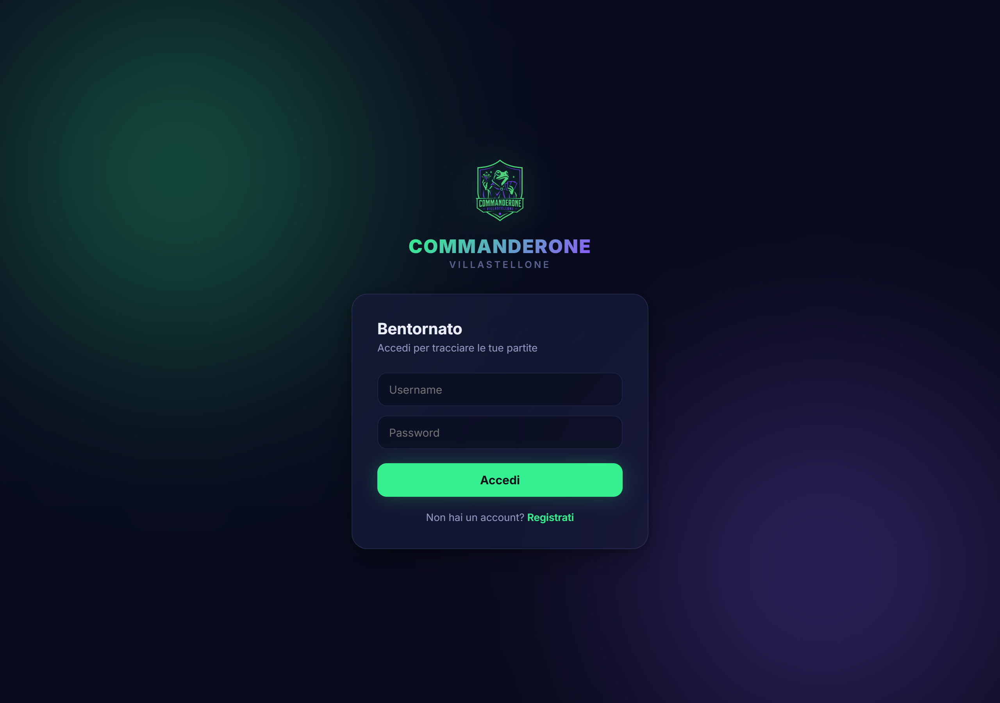

- Se hai già un account, inserisci **username** e **password** e premi **Accedi**.
- Se è la prima volta, clicca **Registrati**: oltre a username e password ti verrà chiesto un **codice d'invito**.

> 🔑 **Il codice d'invito** si chiede a un membro del gruppo (o all'amministratore). Serve a tenere fuori gli estranei: senza codice non ci si può registrare.

---

## 2. Tema chiaro / scuro

In alto a destra trovi l'icona **🌙 / ☀**: cliccala per passare da tema scuro a chiaro. La tua scelta viene ricordata sul dispositivo.

Accanto trovi il tuo nome e il pulsante **Esci**.

---

## 3. I miei mazzi

Dal menu in alto vai su **Mazzi**.

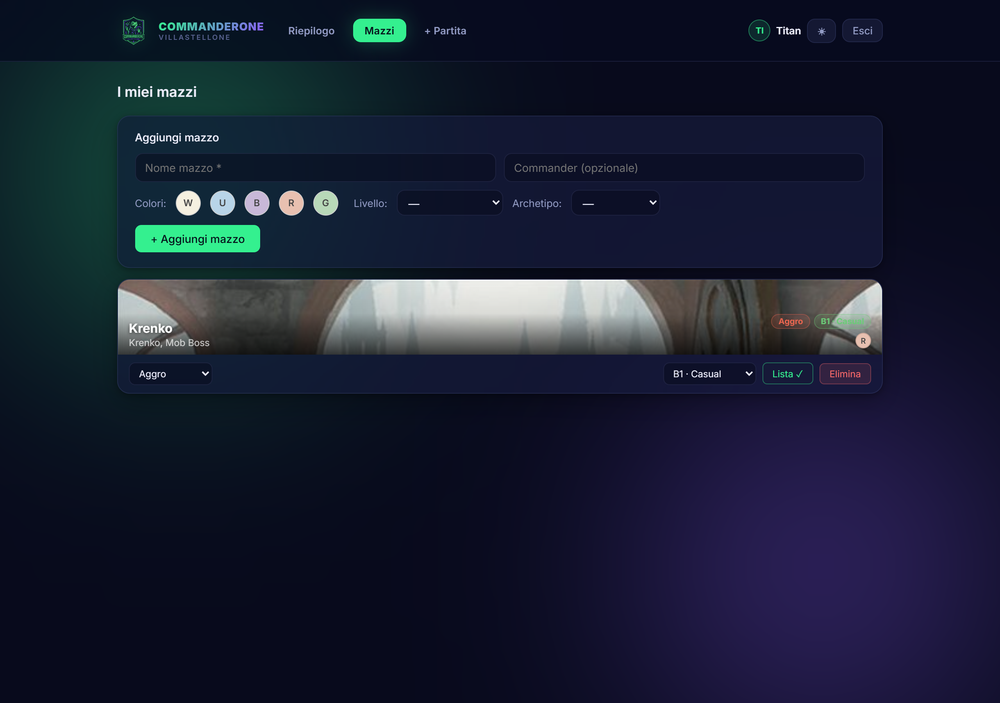

### Aggiungere un mazzo
Nel riquadro **Aggiungi mazzo**:
1. Scrivi il **nome** del mazzo (obbligatorio).
2. Scrivi il **Commander**: man mano che digiti compaiono i suggerimenti ufficiali — scegli quello giusto dall'elenco.
3. I **colori** vengono rilevati automaticamente dal commander (puoi comunque aggiustarli a mano cliccando i pallini W/U/B/R/G).
4. Scegli il **Livello** e l'**Archetipo** del mazzo (vedi sotto). Sono entrambi facoltativi.
5. Premi **+ Aggiungi mazzo**.

### Il livello (bracket)
Ogni mazzo può avere un livello di potenza, utile per comporre tavoli equilibrati:

| Livello | Significato |
|---------|-------------|
| **B1 · Casual** | Mazzo da divertimento, niente combo veloci |
| **B2 · Bilanciato** | Mazzo onesto, sinergie ma non spietato |
| **B3 · Potente** | Mazzo ottimizzato, combo e tutori |
| **B4 · cEDH** | Massima potenza competitiva |

Puoi **cambiare il livello in qualsiasi momento** dal menu a tendina sulla card del mazzo: si salva da solo.

### L'archetipo
Oltre al livello, ogni mazzo può avere un **archetipo**: dice *come* gioca il mazzo, al di là dei colori. Comodo per riconoscere a colpo d'occhio lo stile e per filtrare le classifiche.

| Archetipo | In breve |
|-----------|----------|
| **Aggro** | Pressione veloce, vuole chiudere presto |
| **Midrange** | Carte solide ed efficienti, gioco di valore |
| **Control** | Rimozioni e contromagie, vince nel lungo |
| **Combo** | Punta a una combinazione che chiude la partita |
| **Stax** | Risorse negate e blocco del tavolo |
| **Aristocrats** | Sacrifici e drenaggi, vince a piccoli colpi |
| **Tokens** | Sciami di pedine che crescono di numero |
| **Voltron** | Una sola minaccia super-equipaggiata |
| **Ramp** | Accelera il mana per minacce enormi |

Scegli l'archetipo **alla creazione** del mazzo (menu *Archetipo*) oppure **in qualsiasi momento** dal menu a tendina sulla card del mazzo: come per il livello, si salva da solo. Il badge colorato dell'archetipo compare poi ovunque appaia il mazzo.

### La miniatura
Ogni mazzo mostra l'illustrazione del suo commander come copertina. La trovi ovunque nel portale: classifiche, storico, matchup. Passandoci sopra col mouse vedi la carta in grande.

---

## 4. La lista del mazzo

Sulla card di ogni tuo mazzo c'è il pulsante **Lista**. Cliccalo per **vedere** o **modificare** la lista delle 100 carte.

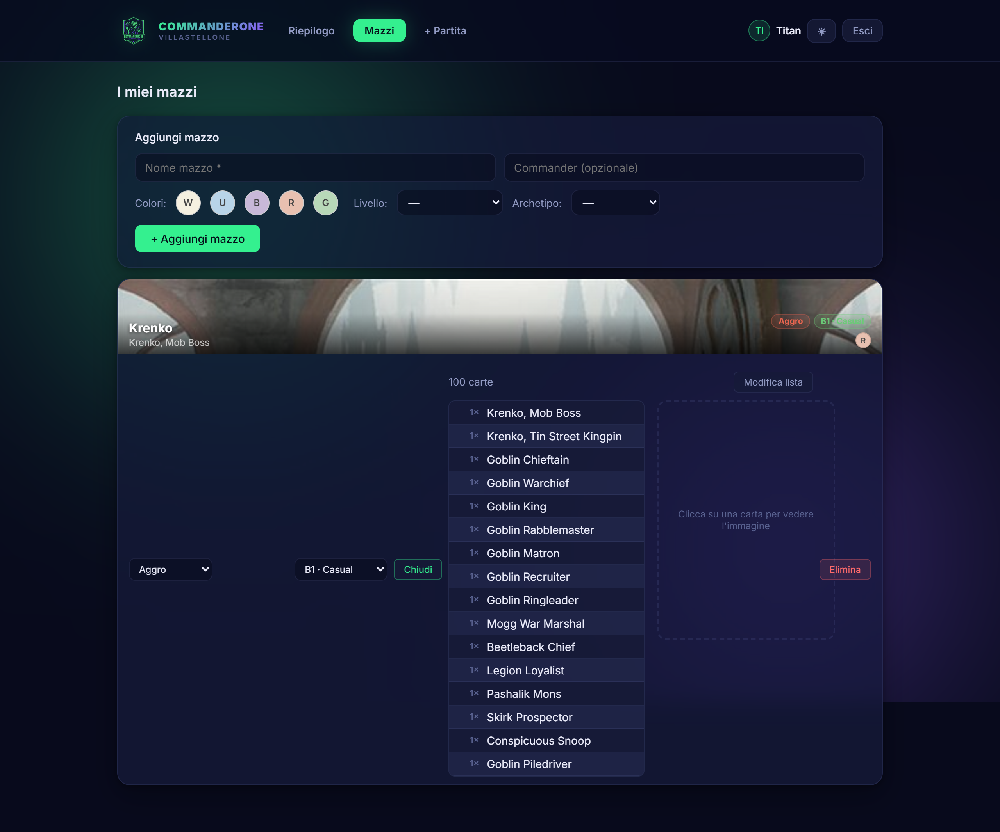

### Visualizzare
La lista appare a sinistra (una carta per riga). **Clicca una carta** per vederne l'immagine grande a destra.

### Modificare / inserire
Premi **Modifica lista**. Hai tre modi per riempirla:

- **Import automatico** — incolla l'URL del mazzo da **Archidekt** (o Moxfield) e premi **Importa**: nome del commander e carte vengono compilati da soli.
  > Se Moxfield blocca l'import, aprilo lì → **More → Export → Text**, copia tutto e incolla nel riquadro.
- **A mano** — scrivi il **Commander** in alto e le **99 carte rimanenti** nel riquadro grande, una per riga nel formato `1 Sol Ring`.

Quando premi **Salva lista** il sistema controlla che:
- ci siano **esattamente 100 carte** (commander incluso);
- **ogni carta esista** davvero (verifica su Scryfall).

Se qualcosa non torna, ti dice esattamente cosa correggere. Salvando, i colori e l'immagine del mazzo si aggiornano in automatico.

---

## 5. Registrare una partita

Dal menu in alto vai su **+ Partita**.

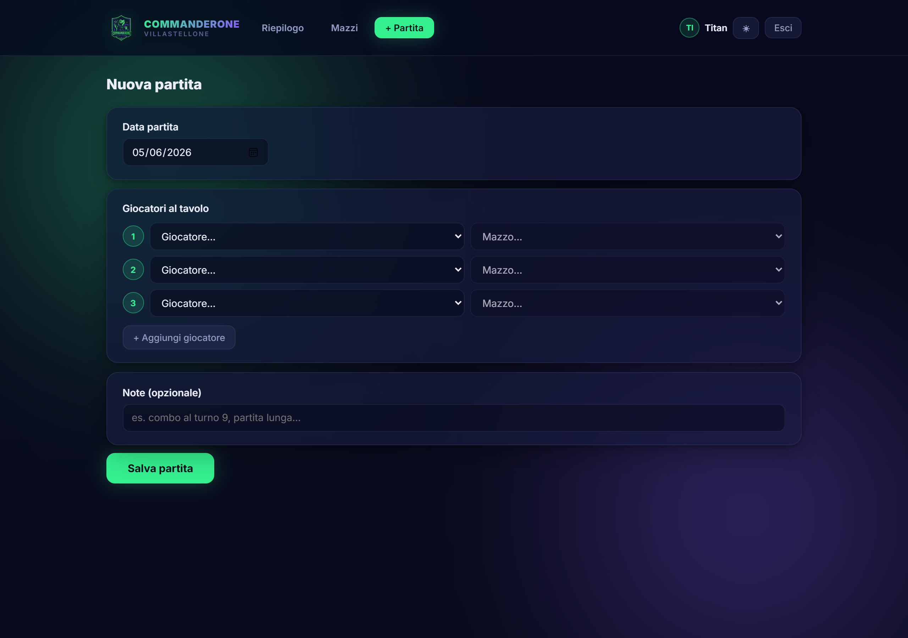

1. **Data partita** — di default è oggi, ma puoi indicare una data passata.
2. **Giocatori al tavolo** — per ogni posto scegli **giocatore** e **mazzo**. Servono almeno 3 giocatori; con **+ Aggiungi giocatore** arrivi fino a 5.
3. **Chi ha vinto?** — clicca il giocatore/mazzo vincente.
4. **Ordine di uscita** *(opzionale)* — clicca i perdenti nell'ordine in cui sono stati eliminati, dal primo all'ultimo. Il vincitore è automaticamente 1°. Serve per le statistiche di piazzamento.
5. **Eliminazioni** *(opzionale)* — per ogni giocatore eliminato indica **chi l'ha buttato fuori**. Sblocca arcinemico, preda preferita e kill count.
6. **Note** *(opzionale)* — un commento sulla partita ("combo al turno 7", ecc.).
7. Premi **Salva partita** 🎉

> I passaggi 4 e 5 sono facoltativi: se li salti, la partita viene comunque registrata con vincitore e partecipanti.

---

## 6. Il Riepilogo (statistiche)

La home (**Riepilogo**) raccoglie tutte le statistiche del gruppo, divise in schede.

### Stagione 🏆
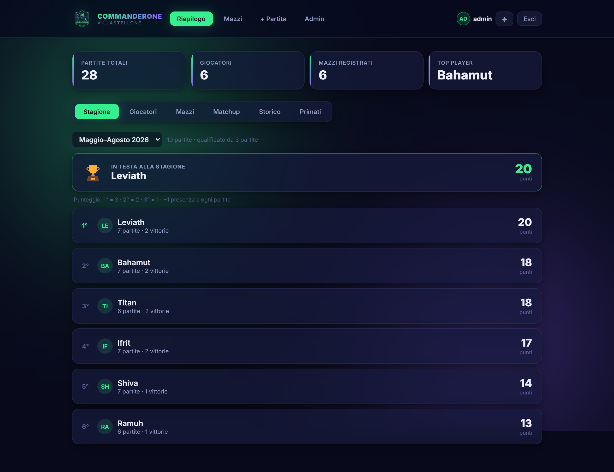

La classifica del **campionato in corso**. Le stagioni durano **4 mesi** e si rinnovano da sole (Gennaio–Aprile, Maggio–Agosto, Settembre–Dicembre): ogni partita finisce nella stagione giusta in base alla sua data.

Il punteggio si assegna **per piazzamento**:

| Posizione | Punti |
|-----------|-------|
| 1° (vittoria) | 3 |
| 2° | 2 |
| 3° | 1 |
| 4°/5° | 0 |

In più ogni partita giocata dà **+1 di presenza**: così una vittoria vale 4 punti e anche chi arriva ultimo porta a casa 1 punto — l'importante è **esserci**. I punti si sommano lungo la stagione, quindi chi smette di giocare viene superato da chi continua.

Per essere proclamato **Campione** bisogna aver giocato almeno il **30% delle partite** della stagione (chi è sotto soglia appare comunque in classifica con l'etichetta "non qualif."). In cima trovi la card **"In testa alla stagione"** con il leader. Usa il menu a tendina per rivedere le stagioni passate.

> Nota: i punti di 2° e 3° posto si calcolano se hai registrato l'**ordine di uscita** della partita. Se hai segnato solo il vincitore, i punti vanno al 1° e a tutti gli altri resta il punto presenza.

### Giocatori
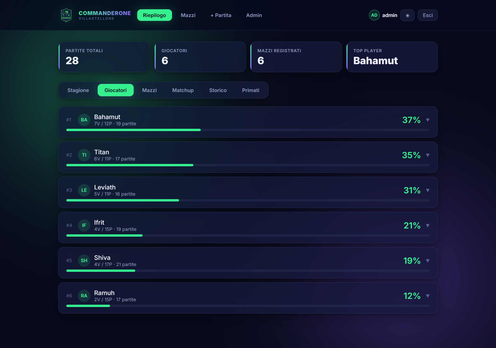

Classifica per win rate. **Clicca su un giocatore** per espandere i suoi mazzi e aprire il suo profilo completo.

### Mazzi
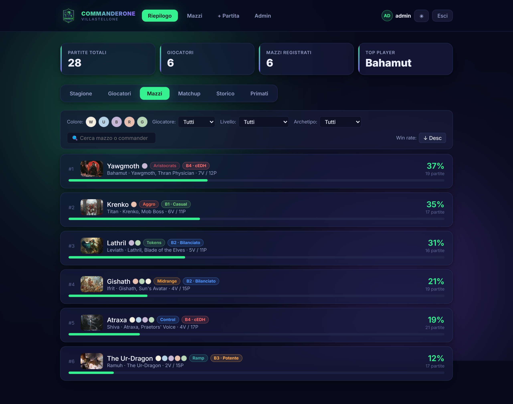

Tutti i mazzi con il loro win rate, ciascuno con i badge di **archetipo** e **livello**. Puoi **filtrare** per:
- **colore** (mostra i mazzi che contengono quei colori),
- **giocatore**,
- **livello** (bracket),
- **archetipo**,
- **ricerca** per nome o commander,

e **ordinare** per win rate crescente/decrescente. Clicca un mazzo per aprirne il profilo.

### Matchup
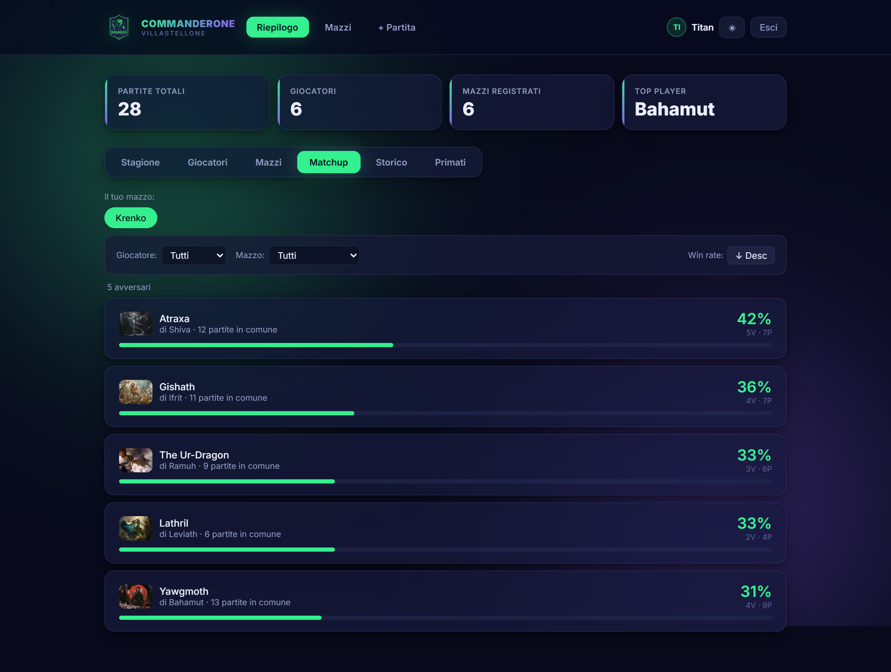

Scegli **il tuo mazzo** e vedi come se la cava contro gli altri mazzi del gruppo. Puoi filtrare gli avversari per giocatore o per mazzo specifico.

### Storico
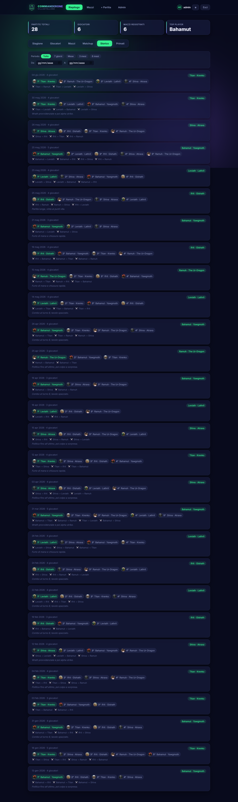

L'elenco di tutte le partite, con classifica completa (1°, 2°, 3°…), vincitore e le eliminazioni (`⚔️ chi → chi`). Filtra per **periodo** (ultimi 7 giorni, mese, 3 o 6 mesi) o per **intervallo di date**.

### Primati
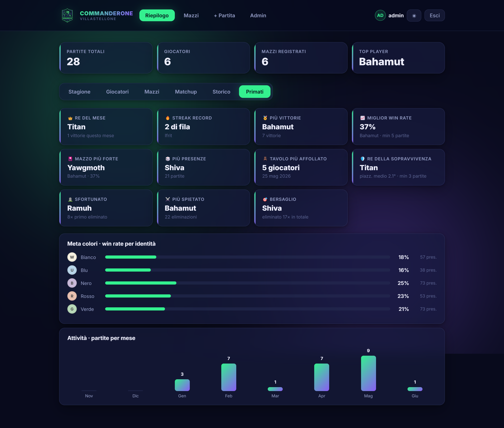

L'albo d'oro del gruppo: **Re del mese**, **streak record**, **più vittorie**, **miglior win rate**, **mazzo più forte**, **Re della sopravvivenza**, **Sfortunato**, **Più spietato** (più eliminazioni), **Bersaglio**, oltre al **meta colori** (quali colori vincono di più) e al grafico delle **partite per mese**.

---

## 7. Profilo giocatore

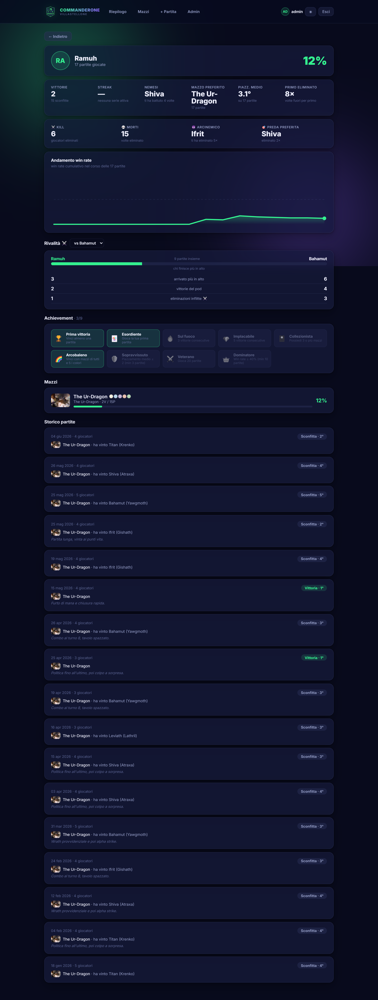

Mostra tutto su un giocatore:
- **win rate** complessivo, vittorie, **streak**, **nemesi**, **mazzo preferito**, **piazzamento medio**;
- statistiche di **eliminazione**: ⚔️ kill, 💀 morti, 😈 **arcinemico** (chi ti elimina di più), 🎯 **preda preferita**;
- il **grafico dell'andamento** del win rate nel tempo;
- la **Rivalità ⚔️** (scontri diretti) con un avversario a scelta (vedi sotto);
- gli **achievement** sbloccati (prima vittoria, streak, arcobaleno, veterano…);
- l'elenco dei **mazzi** (cliccabili) e lo **storico personale**.

### Rivalità ⚔️ (scontri diretti)
Scegli un **avversario** dal menu a tendina e vedi il vostro testa a testa, considerando **solo le partite giocate insieme**:

- **chi è arrivato più in alto** (piazzamento migliore) nelle partite condivise — riassunto dalla barra "chi finisce più in alto";
- **vittorie del pod** a testa (chi ha vinto di più di quelle stesse partite);
- **eliminazioni inflitte ⚔️** dell'uno contro l'altro.

> Le partite condivise **senza ordine di uscita** non si possono assegnare a un piazzamento: vengono contate a parte e segnalate sotto al confronto.

---

## 8. Profilo mazzo

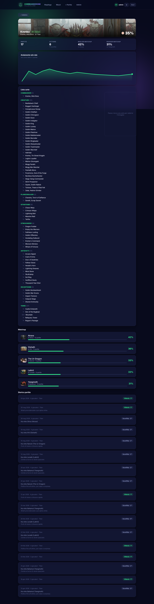

Per ogni mazzo: copertina del commander, **archetipo** e **livello**, win rate, **miglior e peggior matchup**, andamento nel tempo, l'elenco completo dei matchup e lo storico delle sue partite.

**Si apre da ovunque appaia il mazzo**: classifica Mazzi, mazzi nel profilo di un giocatore, avversari nel Matchup, chip nello Storico, la tua pagina "I miei mazzi" e la lista in Admin — basta cliccarlo.

### La lista carte per tipo
Se il mazzo ha la lista caricata, nel profilo trovi la **decklist completa raggruppata per categoria**: Commander, Creature, Istantanei, Stregonerie, Artefatti, Incantesimi, Planeswalker, Terre, con il conteggio per ogni gruppo. **Passa o tocca una carta** per vederne l'immagine in grande.

---

## 9. Sul telefono

Commanderone è una **PWA**: puoi installarlo come un'app vera.

- **Android (Chrome)**: apri il sito → menu ⋮ → **Installa app** / **Aggiungi a schermata Home**.
- **iPhone (Safari)**: apri il sito → tasto **Condividi** → **Aggiungi a Home**.

Comparirà l'icona 🐸 e l'app si aprirà a schermo intero — comodissimo per segnare le partite al tavolo.

### Navigazione da smartphone
Su telefono l'interfaccia si adatta: in alto resta il **logo**, e in basso compare una **barra di navigazione** (dock) con i tasti principali, comodi da raggiungere col pollice:

- 🏠 **Home** — il Riepilogo
- 🎴 **Mazzi**
- ＋ **Partita** — registra una partita
- 👤 **Tu** — il tuo profilo
- ⚙ **Admin** — solo per gli amministratori

Le schede del Riepilogo si scorrono lateralmente con il dito.

---

## 10. Per gli amministratori

Chi ha il ruolo **ADMIN** vede in più la scheda **Admin**:

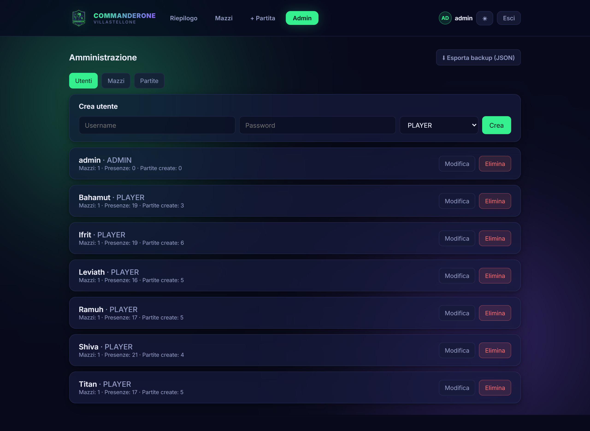

- **Utenti** — crea, modifica (anche la password) ed elimina account.
- **Mazzi** — gestisce i mazzi di **tutti** i giocatori (nome, commander, colori, livello, archetipo, lista).
- **Partite** — modifica o elimina qualsiasi partita (giocatori, vincitore, ordine, eliminazioni, data).
- **⬇ Esporta backup (JSON)** — scarica un backup completo di utenti, mazzi e partite.

L'admin non compare nelle classifiche né nei matchup: non è un giocatore.

---

## 11. Domande frequenti

**Ho dimenticato la password.**
Chiedi a un amministratore di reimpostartela dal pannello Utenti.

**Perché il mio mazzo non mostra l'immagine del commander?**
Probabilmente il nome del commander non combacia esattamente con quello su Scryfall. Modifica il mazzo e riscrivi il commander scegliendolo dai suggerimenti.

**Devo per forza inserire ordine di uscita ed eliminazioni?**
No, sono opzionali. Però se li compili sblocchi statistiche molto più ricche (piazzamenti, arcinemico, kill…).

**La lista non si salva.**
Controlla di avere **esattamente 100 carte** (commander incluso) e che i nomi siano corretti: il sistema segnala le carte che non trova.

**Posso cambiare il livello di un mazzo dopo averlo creato?**
Sì, dal menu a tendina sulla card del mazzo, in qualsiasi momento.

**E l'archetipo?**
Uguale: scegli l'archetipo alla creazione oppure cambialo quando vuoi dal menu a tendina sulla card del mazzo. Si salva da solo e il badge si aggiorna ovunque. Livello e archetipo sono entrambi facoltativi.

**Come si vince la stagione?**
Si accumulano punti per piazzamento (3/2/1) + 1 di presenza a ogni partita. Vince chi ha più punti tra i **qualificati** (almeno il 30% delle partite della stagione). Le stagioni durano 4 mesi e si rinnovano da sole. Per far contare i punti di 2° e 3° posto, ricorda di registrare l'**ordine di uscita** della partita.

---

*Buone partite, e che vinca il mazzo migliore! 🐸*
