# 🐸 Commanderone · Guida Utente

Benvenuto su **Commanderone**, il portale del gruppo **Villastellone** per tracciare le partite di Magic: The Gathering in formato **Commander (EDH)**.

Questa guida mostra tutto quello che puoi fare, con screenshot presi direttamente dall'app su telefono.

---

## Indice

1. [Accesso e registrazione](#1-accesso-e-registrazione)
2. [Navigazione — il dock e l'header](#2-navigazione--il-dock-e-lheader)
3. [Feed — la home](#3-feed--la-home)
4. [Gioca](#4-gioca)
5. [Registrare una partita](#5-registrare-una-partita)
6. [I miei mazzi](#6-i-miei-mazzi)
7. [La lista del mazzo](#7-la-lista-del-mazzo)
8. [Gruppo — statistiche del gruppo](#8-gruppo--statistiche-del-gruppo)
9. [Profilo giocatore](#9-profilo-giocatore)
10. [Profilo mazzo](#10-profilo-mazzo)
11. [Eventi — il calendario](#11-eventi--il-calendario)
12. [Judge Bot](#12-judge-bot)
13. [Notifiche](#13-notifiche)
14. [Installare l'app sul telefono](#14-installare-lapp-sul-telefono)
15. [Per gli amministratori](#15-per-gli-amministratori)
16. [Domande frequenti](#16-domande-frequenti)

---

## 1. Accesso e registrazione

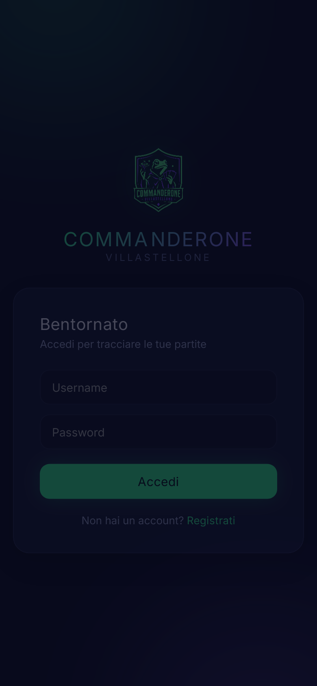

- Se hai già un account inserisci **username** e **password** e premi **Accedi**.
- Prima volta? Premi **Registrati**: ti verrà chiesto anche un **codice d'invito**.

> 🔑 **Il codice d'invito** lo chiedi a un membro del gruppo o all'amministratore. Senza di esso non è possibile creare un account.

---

## 2. Navigazione — il dock e l'header

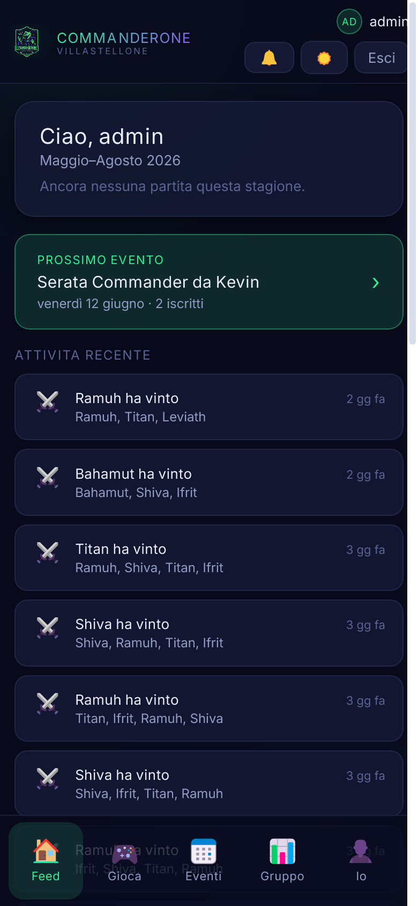

Su telefono la navigazione è tutta raggiungibile con il pollice:

**Header in alto:**
- Logo e nome del portale
- 🔔 **Campanella** — notifiche (pallino rosso se ci sono novità)
- 🌙/☀ **Tema** — passa da dark a light (si ricorda sul dispositivo)
- **Esci** — disconnessione

**Dock in basso — 5 tasti:**

| Tasto | Dove va |
|-------|---------|
| 🏠 **Feed** | La home: riassunto stagione + ultime partite |
| 🎮 **Gioca** | Registra una partita o consulta il Judge Bot |
| 📅 **Eventi** | Il calendario del gruppo |
| 📊 **Gruppo** | Statistiche complete del gruppo |
| 👤 **Io** | Il tuo profilo personale |

Su **desktop** c'è la barra in alto con le voci: Feed · Gioca · Eventi · Gruppo · Mazzi · (Admin).

---

## 3. Feed — la home

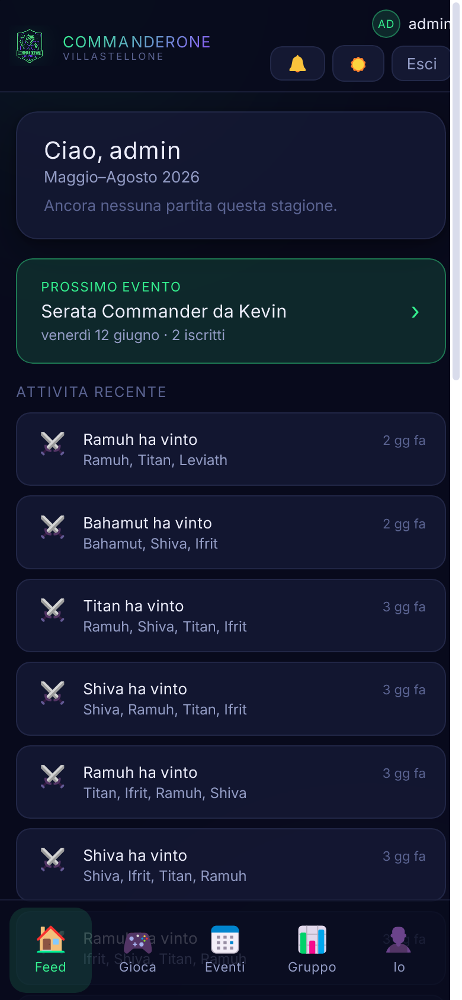

Il Feed è la prima schermata dopo il login. Mostra tutto quello che conta in un colpo d'occhio:

- **Card di benvenuto** — "Ciao, [nome]" con la stagione in corso, il tuo rank e win rate attuali. Se sei in streak compare anche quella.
- **Prossimo evento** — banner verde con nome, data e numero di iscritti. Toccalo per aprire il dettaglio dell'evento.
- **Attività recente** — le ultime partite del gruppo in ordine cronologico, con vincitore e partecipanti. Le notifiche non lette compaiono qui con un bordo colorato.

---

## 4. Gioca

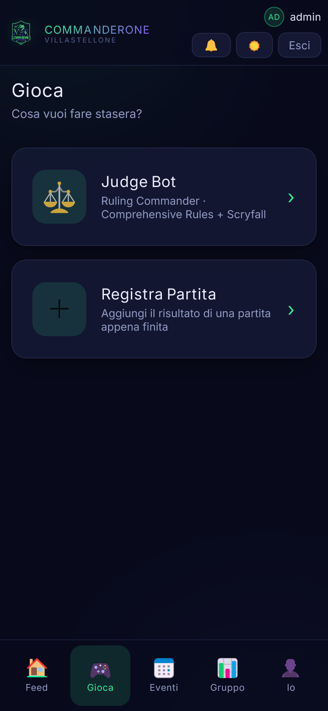

La sezione **Gioca** è il punto di partenza per la serata:

- **Registra Partita** — porta direttamente al form per segnare il risultato di una partita appena conclusa.
- **Judge Bot** — hai un dubbio su una regola? Chiedilo qui (vedi sezione [12](#12-judge-bot)).

Se hai già giocato di recente, sotto alle CTA trovi anche i **tuoi mazzi usati di recente** con un link rapido al profilo di ciascuno.

---

## 5. Registrare una partita

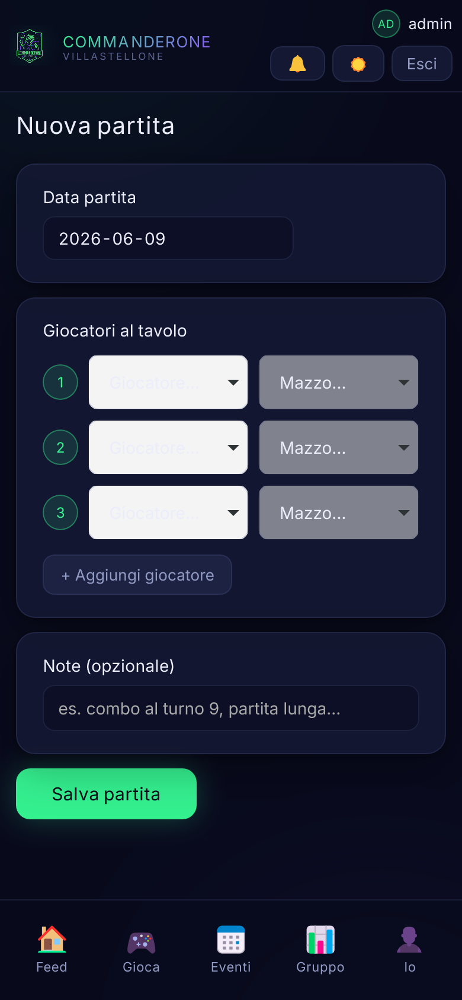

Premi **Registra Partita** da Gioca (o accedi direttamente da Gioca → Registra Partita).

1. **Data partita** — di default è oggi; puoi cambiare per segnare partite passate.
2. **Giocatori al tavolo** — per ogni posto scegli **giocatore** e **mazzo**. Servono almeno 3; con **+ Aggiungi giocatore** arrivi a 5.
3. **Chi ha vinto?** — seleziona il vincitore dalla lista.
4. **Ordine di uscita** *(facoltativo)* — tocca i giocatori eliminati nell'ordine in cui sono usciti, dal primo all'ultimo. Il vincitore è automaticamente 1°. Serve per i piazzamenti e le statistiche di sopravvivenza.
5. **Eliminazioni** *(facoltativo)* — per ogni eliminato indica chi l'ha buttato fuori. Sblocca le statistiche di kill, arcinemico e preda preferita.
6. **Note** *(facoltativo)* — un appunto sulla partita ("combo al turno 7", ecc.).
7. Premi **Salva partita** 🎉

> I passi 4 e 5 sono opzionali: la partita viene registrata correttamente anche senza. Ma se li compili ottieni statistiche molto più ricche.

---

## 6. I miei mazzi

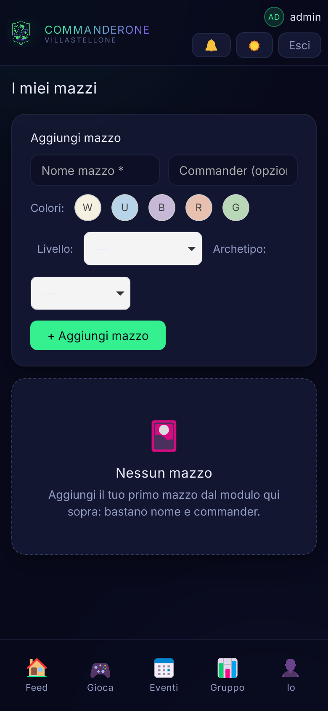

Su desktop trovi **Mazzi** nella barra in alto. Su telefono puoi raggiungerli dal tuo profilo (**Io** nel dock) oppure dalla tab **Mazzi** nella sezione Gruppo.

### Aggiungere un mazzo
Nel riquadro **Aggiungi mazzo**:
1. Scrivi il **nome** del mazzo.
2. Scrivi il **Commander** — man mano che digiti compaiono i suggerimenti ufficiali: scegli dall'elenco.
3. I **colori** si rilevano in automatico dal commander (puoi aggiustarli a mano con i pallini W/U/B/R/G).
4. Scegli il **Livello** e l'**Archetipo** (entrambi facoltativi, vedi sotto).
5. Premi **+ Aggiungi mazzo**.

### Il livello (bracket)
Indica la potenza del mazzo — utile per comporre tavoli equilibrati:

| Livello | Significato |
|---------|-------------|
| **B1 · Casual** | Divertimento, niente combo veloci |
| **B2 · Bilanciato** | Mazzo onesto, sinergie ma non spietato |
| **B3 · Potente** | Ottimizzato, combo e tutori |
| **B4 · cEDH** | Massima potenza competitiva |

### L'archetipo
Dice *come* gioca il mazzo al di là dei colori:

| Archetipo | In breve |
|-----------|----------|
| **Aggro** | Pressione veloce |
| **Midrange** | Carte efficienti, gioco di valore |
| **Control** | Rimozioni e contromagie |
| **Combo** | Chiude con una combinazione |
| **Stax** | Blocca le risorse altrui |
| **Aristocrats** | Sacrifici e drenaggi |
| **Tokens** | Sciami di pedine |
| **Voltron** | Una sola minaccia super-potenziata |
| **Ramp** | Accelera il mana per minacce enormi |

Puoi cambiare livello e archetipo in qualsiasi momento dalla card del mazzo — il badge si aggiorna subito ovunque.

### La miniatura
Ogni mazzo mostra l'illustrazione del commander come copertina. Su desktop passa il mouse per vederla in grande; su telefono tocca la carta nel profilo mazzo.

---

## 7. La lista del mazzo

Sulla card di ogni tuo mazzo c'è il pulsante **Lista**. Aprilo per vedere o modificare le 100 carte.

### Importare da URL
Premi **Importa da URL**, incolla il link del mazzo da **Archidekt** (funziona sempre) e premi **Importa**: commander e carte si compilano da soli.

> Se usi **Moxfield**: apri il mazzo lì → More → Export → Text, copia tutto e incollalo nel riquadro a mano.

### Inserimento manuale
Scrivi il commander nel campo apposito e le 99 carte nel riquadro, una per riga nel formato `1 Sol Ring`.

Quando premi **Salva lista** il sistema verifica che ci siano **esattamente 100 carte** e che ogni nome esista su Scryfall. Se qualcosa non torna, ti dice esattamente cosa correggere. Salvando, colori e immagine del mazzo si aggiornano automaticamente.

---

## 8. Gruppo — statistiche del gruppo

La sezione **Gruppo** raccoglie tutte le statistiche collettive. In cima trovi 4 metriche globali (partite totali, giocatori, mazzi, top player), poi 4 tab.

### Tab Stagione

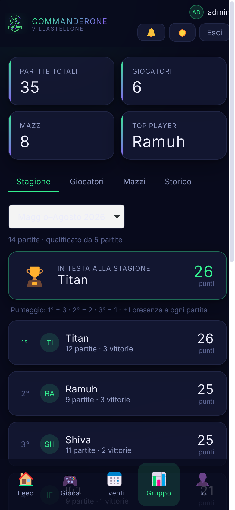

La classifica del campionato in corso. Le stagioni durano **4 mesi** (Gen–Apr · Mag–Ago · Set–Dic) e si rinnovano da sole.

Il punteggio si assegna per piazzamento:

| Posizione | Punti |
|-----------|-------|
| 1° (vittoria) | 3 |
| 2° | 2 |
| 3° | 1 |
| 4°/5° | 0 |
| Ogni partita giocata | +1 |

Così anche chi arriva ultimo porta a casa 1 punto — l'importante è **esserci**. Per essere dichiarato campione bisogna aver giocato almeno il **30%** delle partite della stagione (chi è sotto soglia compare con l'etichetta *"non qualif."*).

Usa il **menu a tendina** per sfogliare le stagioni passate.

> I punti di 2° e 3° posto si calcolano solo se hai registrato l'**ordine di uscita** della partita.

**Primati** (sezione collassabile nella tab Stagione):

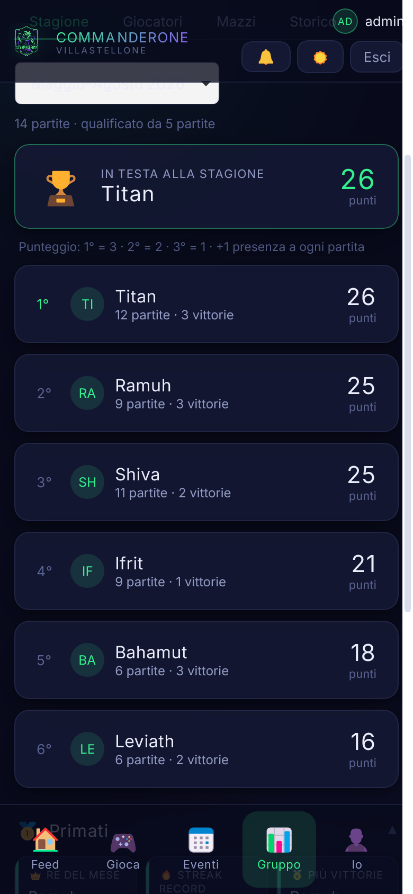

L'albo d'oro: Re del mese, Streak record, Più vittorie, Miglior win rate, Mazzo più forte, Più presenze, Tavolo record, Re della sopravvivenza, Sfortunato, Più spietato, Bersaglio.

Tocca **Meta colori** per aprire il pannello con il win rate per colore e il grafico delle partite mensili.

### Tab Giocatori

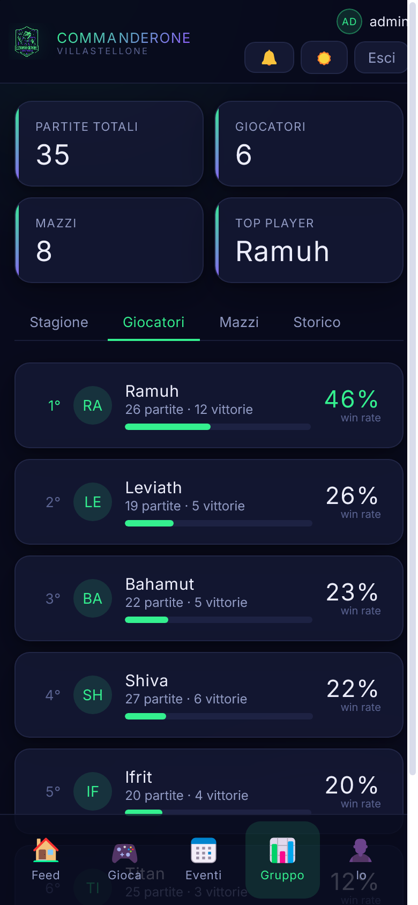

Tutti i giocatori ordinati per win rate, con la barra di avanzamento. **Tocca un giocatore** per aprire il suo profilo completo.

### Tab Mazzi

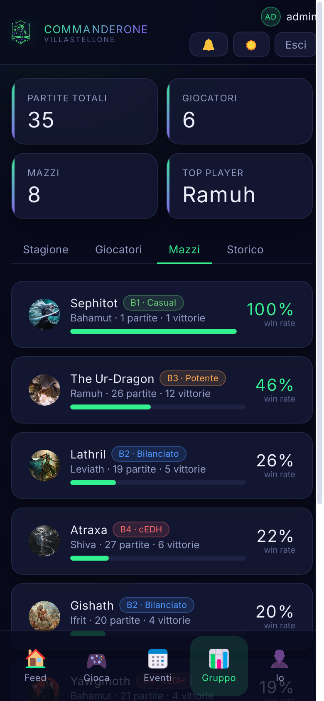

Tutti i mazzi del gruppo ordinati per win rate, con l'immagine del commander, il badge di livello e il badge archetipo. **Tocca un mazzo** per aprirne il profilo.

### Tab Storico

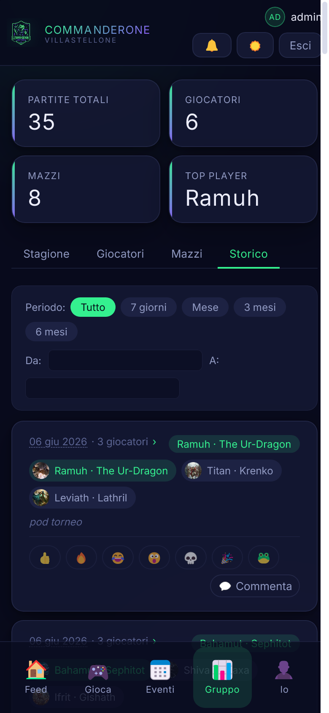

L'elenco completo di tutte le partite con vincitore, partecipanti e kill (`⚔️ chi → chi`). Filtra per **periodo** (7 giorni, mese, 3 o 6 mesi) o per **intervallo di date** personalizzato.

Ogni partita ha la sua sezione **social**: **reazioni** emoji (👍 🔥 😂 😮 💀 🎉 🐸) e **commenti**. Tocca un'emoji per reagire — ritoccala per rimuoverla. Premi **💬 Commenta** per lasciare un messaggio; puoi eliminare i tuoi con la ✕.

---

## 9. Profilo giocatore

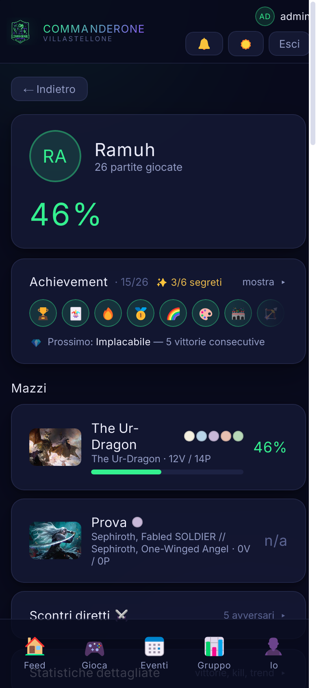

Si apre toccando un giocatore nella tab Giocatori, nel Feed o nel dock **Io** per il tuo profilo. Mostra:

- **Header** — avatar con iniziali, win rate globale, partite totali, eventuale streak attiva.
- **Achievement** — quanti ne hai sbloccati (es. *15/20, 3/6 segreti*) con l'anteprima del prossimo obiettivo. Tocca per espandere tutti i badge.

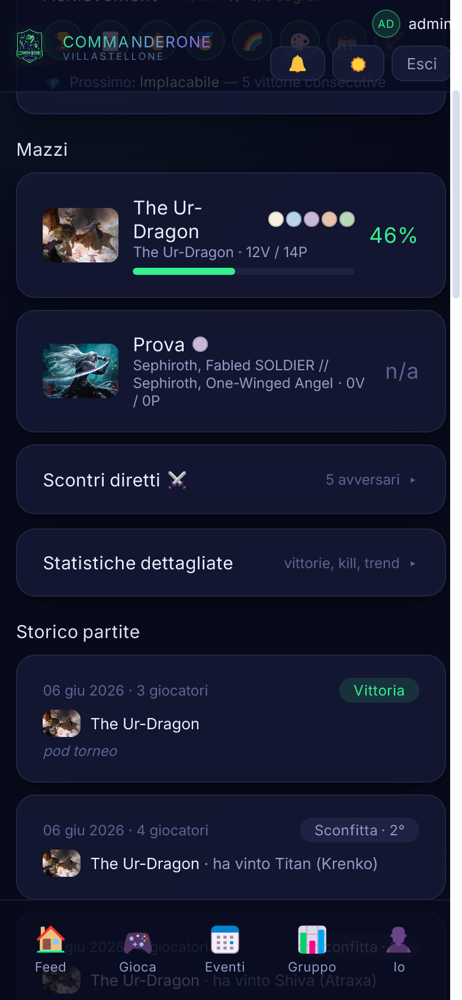

- **Mazzi** — i mazzi del giocatore con win rate e link al profilo.
- **Scontri diretti ⚔️** *(collassabile)* — scegli un avversario e vedi il vostro testa a testa: piazzamento medio, vittorie condivise, kill reciproci.
- **Statistiche dettagliate** *(collassabile)* — kill totali, morti, arcinemico, preda preferita, piazzamento medio, andamento win rate nel tempo.
- **Storico partite** — tutte le partite di quel giocatore.

---

## 10. Profilo mazzo

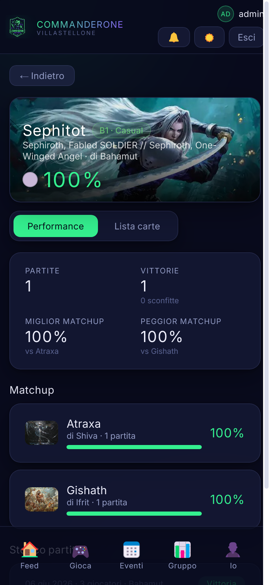

Si apre toccando un mazzo ovunque appaia. Mostra il banner con l'illustrazione del commander, poi due tab:

**Tab Performance:**
- Statistiche: partite, vittorie, win rate, miglior e peggior matchup.
- Stima del prezzo del mazzo in euro (da Scryfall, se la lista è caricata).
- Matchup contro tutti gli avversari con win rate.
- Andamento del win rate nel tempo *(collassabile)*.
- Storico partite con quel mazzo.

**Tab Lista carte:**

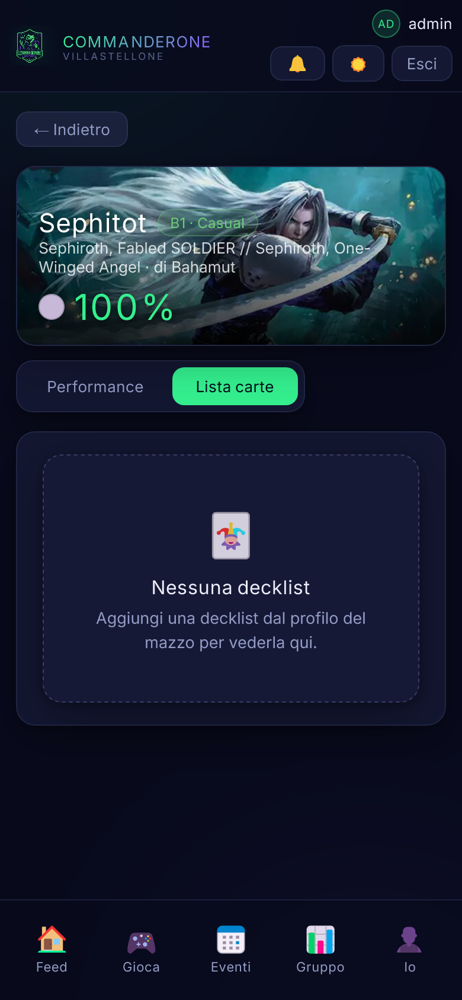

Le 100 carte raggruppate per tipo (Commander, Creature, Istantanei, Stregonerie, Artefatti, Incantesimi, Planeswalker, Terre). **Tocca una carta** per vedere l'immagine in grande.

---

## 11. Eventi — il calendario

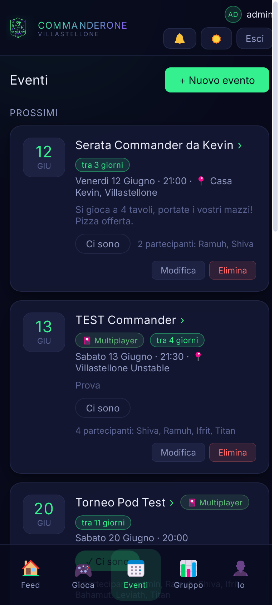

Tocca **📅 Eventi** nel dock per vedere il calendario del gruppo: serate Commander, ritrovi, tornei.

- Gli eventi **prossimi** sono in cima con un'etichetta *"tra N giorni"*, **Oggi** o **Domani**.
- Ogni evento mostra data, orario, 📍 luogo, descrizione e numero di iscritti.
- Gli eventi **passati** restano visibili in fondo, in grigio.

### Ci sono!
Tocca **Ci sono** su un evento per segnare la tua partecipazione: il pulsante si evidenzia e il tuo nome entra nella lista. Ripremi per toglierti.

> ✋ Solo gli **amministratori** possono creare, modificare o eliminare eventi.

---

## 12. Judge Bot

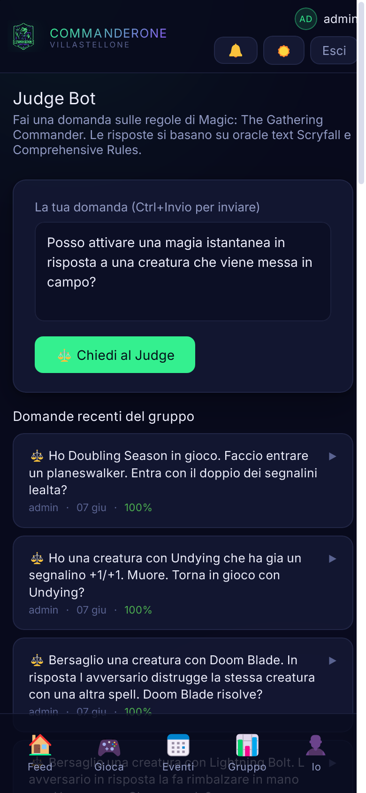

Hai un dubbio su una regola Commander? Il **Judge Bot** risponde in italiano basandosi sulle **Comprehensive Rules ufficiali** e sull'oracle text di Scryfall.

Puoi raggiungerlo da **Gioca → Judge Bot**.

1. Scrivi la tua domanda nella casella di testo (anche in italiano informale — il bot capisce).
2. Premi **Chiedi al Judge** (oppure **Ctrl+Invio** da tastiera).
3. Ricevi: **risposta**, badge di confidenza, carte rilevate nella domanda, regole CR citate.

Sotto al form trovi le **ultime 20 domande del gruppo**: utile per vedere se qualcuno ha già chiesto la stessa cosa.

> Il Judge Bot usa l'AI (Groq) — le risposte sono indicative. Per partite ufficiali fai riferimento sempre alle regole ufficiali.

---

## 13. Notifiche

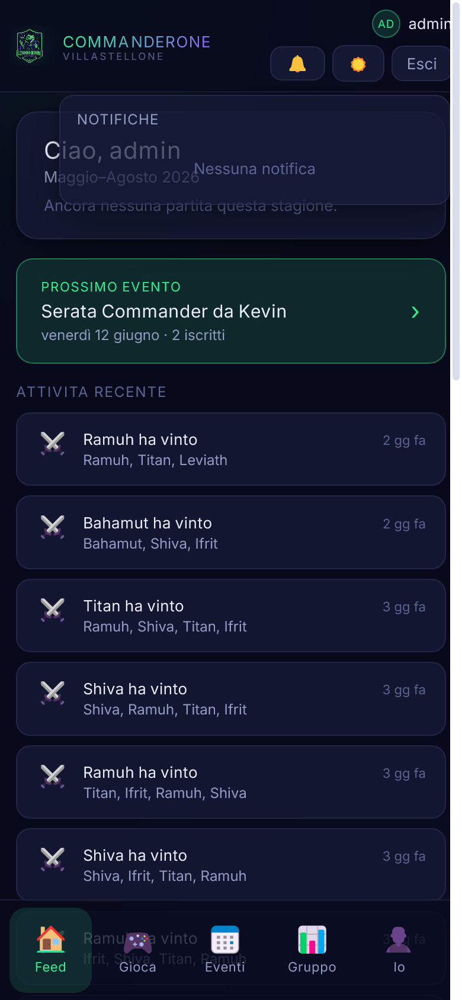

La **campanella 🔔** in alto mostra un pallino rosso quando hai novità non lette. Toccala per aprire l'elenco: aprendo il pannello tutte le notifiche vengono segnate come lette. **Tocca una notifica** per saltare al contenuto collegato.

Ricevi una notifica quando:
- 📅 un admin pubblica un **nuovo evento** nel calendario;
- 🏆 sblocchi un **achievement** (prima vittoria, streak, arcobaleno…);
- 💬 qualcuno **commenta** una partita a cui hai partecipato;
- 🔥 qualcuno **reagisce** a una tua partita.

> Le notifiche si aggiornano da sole ogni minuto — non serve ricaricare la pagina.

---

## 14. Installare l'app sul telefono

Commanderone è una **PWA**: puoi installarla come un'app vera senza passare dall'app store.

**Android (Chrome):**
Apri il sito → menu ⋮ → **Installa app** / **Aggiungi a schermata Home**.

**iPhone (Safari):**
Apri il sito → tasto **Condividi** → **Aggiungi a Home**.

Comparirà l'icona 🐸 e l'app si aprirà a schermo intero — perfetta per segnare partite al tavolo senza distrazioni.

---

## 15. Per gli amministratori

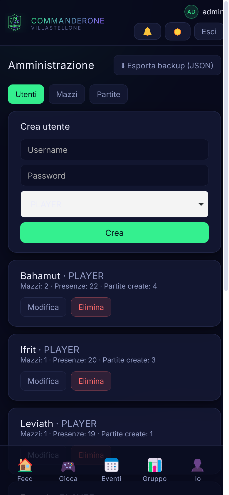

Chi ha il ruolo **ADMIN** vede in alto a destra (o nella navbar desktop) la voce **Admin**. Da qui:

- **Utenti** — crea, modifica (anche la password) ed elimina account.
- **Mazzi** — gestisce i mazzi di **tutti** i giocatori: nome, commander, colori, livello, archetipo, lista.
- **Partite** — modifica o elimina qualsiasi partita (giocatori, vincitore, ordine, eliminazioni, data, note).
- **⬇ Esporta backup (JSON)** — scarica un backup completo di utenti, mazzi e partite.

**Gestione eventi:** dalla pagina **Eventi** gli admin vedono i pulsanti **+ Nuovo evento**, **Modifica** ed **Elimina** su ogni evento. Il form si apre in una finestra sovrapposta — compila e conferma.

> L'admin non appare nelle classifiche né nei matchup: non è un giocatore.

---

## 16. Domande frequenti

**Ho dimenticato la password.**
Chiedi a un amministratore di reimpostartela dal pannello Utenti.

**Perché il mio mazzo non mostra l'immagine del commander?**
Il nome non combacia esattamente con Scryfall. Modifica il mazzo e riscrivi il commander scegliendo dai suggerimenti automatici.

**Devo compilare ordine di uscita ed eliminazioni?**
No, sono facoltativi. Ma se li compili ottieni piazzamenti, arcinemico, kill count e statistiche di sopravvivenza.

**La lista non si salva.**
Controlla di avere **esattamente 100 carte** (commander incluso) e che i nomi siano corretti — il sistema segnala le carte non trovate.

**Come si vince la stagione?**
Si accumulano punti (3/2/1 per piazzamento + 1 presenza a ogni partita). Vince chi ha più punti tra i qualificati (almeno il 30% delle partite della stagione). Per far contare 2° e 3° ricorda di registrare l'**ordine di uscita**.

**Dove trovo i miei mazzi dal telefono?**
Tocca **Io** nel dock per aprire il tuo profilo: lì trovi tutti i tuoi mazzi. In alternativa, dalla sezione **Gruppo → tab Mazzi** vedi tutti i mazzi del gruppo; su desktop la voce **Mazzi** è nella barra in alto.

**Posso commentare o reagire alle partite?**
Sì: ogni partita nello Storico (Gruppo → Storico) ha reazioni emoji e commenti. Puoi rimuovere una tua reazione ritoccandola ed eliminare i tuoi commenti con la ✕.

**Posso creare un evento nel calendario?**
Solo gli **amministratori** creano e gestiscono gli eventi. Tutti gli altri li vedono e possono segnare la propria adesione con **Ci sono**.

**Il Judge Bot può sbagliare?**
Sì. Le risposte si basano sulle Comprehensive Rules e su Scryfall, ma usa l'AI — tratta le risposte come indicazioni da verificare, non verdetti ufficiali.

**Come funzionano gli achievement?**
Ci sono 26 achievement: alcuni pubblici (visibili fin dall'inizio), altri segreti (appaiono solo dopo lo sblocco). Li trovi nel tuo profilo sotto la sezione **Achievement**. Alcuni si sbloccano solo in stagioni concluse.

---

*Buone partite, e che vinca il mazzo migliore! 🐸*
